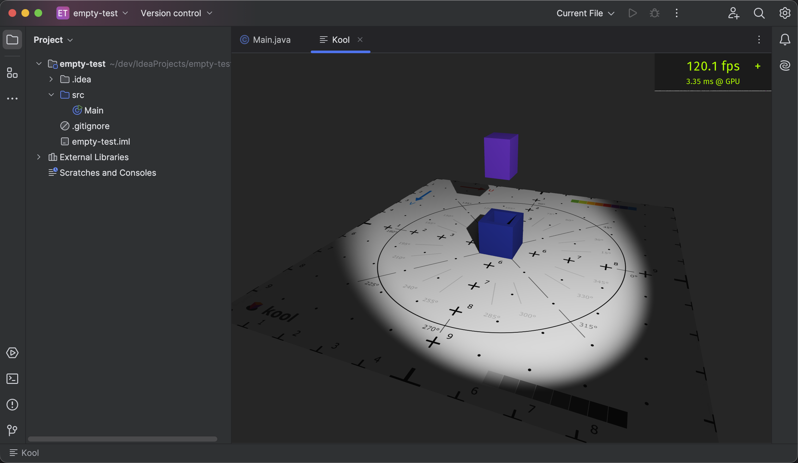

# kool-intellij-template

A stub that shows using kool inside an IntelliJ editor tab. The plugin is based
on the [IntelliJ Platform Plugin Template][template].

<!-- Plugin description -->

To run the plugin, you need to:
- Run the `runIde` gradle task
- Open / create some project in the newly opened IntelliJ window
- Double-tap the shift key to open quick actions, type `Open Kool Tab` and hit enter.

This is still very experimental. Switching between the Kool tab and other editor tabs works
but closing the tab or opening multiple tabs does not.

<!-- Plugin description end -->

[template]: https://github.com/JetBrains/intellij-platform-plugin-template
